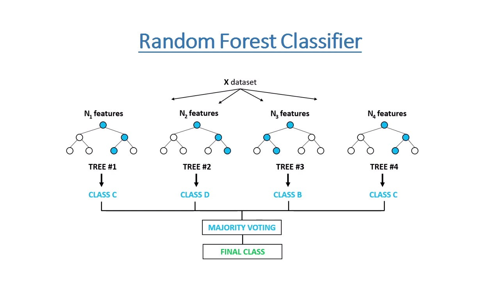

# random forest tutorial

[链接](https://www.kaggle.com/code/prashant111/random-forest-classifier-tutorial)

## 1.介绍

随机森林是一种基于集合学习的监督机器学习算法.在这个内核中,构建了两个随机森林分类器模拟来预测汽车的安全,一个有10个决策树,另一个有100个决策树.模型中决策树的数量增加,期望准确率会增加,医用随机森林模型筛选特征的过程,执照重要特征,利用这些特征重建模型,观察对准确率的影响

## 2.简介

随机森林有两种变体,一种是用于分类问题,另一种用于回归问题,它是最灵活且易用的算法之一.他在给定的数据样本上创建决策树,从每棵树中获取预测,并通过投片选择最佳解,它也是判断功能重要性的一个很好的指标,随机森林算法将多个决策树结合起来,形成森林,因此得名随机森林(`Random Forest`),在随机森林分类器中,森林中树木数量越多,准确率越高

## 3.算法直觉

随机森林可以分为两个阶段:

第一阶段:从`m`个特征中随机选择`k`个特征,并构建随机森林,可按一下步骤进行

1. 从总共`m`特征中随机选择`k`个特征,其中`k` < `m`
2. 在`k`个特征中,利用最佳分裂点计算节点`d`
3. 用最佳分割点将节点拆分为子节点
4. 重复1到3步,直到达到1个节点
5. 通过重复步骤1到4,重复`n`次,以创建`n`棵树

第二阶段:使用训练好的随机森林算法进行预测

1. 利用测试特征,利用每个随机生成的决策树的规则来预测结果并存储结果
2. 然后,我们计算每个预测目标的票数
3. 最后将得票预测目标视为随机森林算法的最终预测

## 4.优缺点

优势:

1. 可以解决分类和回归问题
2. 使用了大量决策树来进行预测,所以模型认为是非常准确且稳健的
3. 随机森林去所有决策树预测的平均值,从而抵消偏差,因此,没有过拟合的问题
4. 可以处理缺失值
   - 使用中位数进行替换连续变量
   - 计算缺失值的邻近加权平均值
5. 随机森林用于特征选择,从训练数据集中选择最重要的特征

缺点:

1. 计算复杂,随机森林预测速度非常慢,因为需要大量决策树来进行预测,森林中的所有树木都必须对相同的输入做出预测,然后对此进行投票,整个过程比较耗时
2. 与决策树相比,这个模型很难解释,而决策树相比,我们可以轻松做出预测

## 5.特征选择

随机森林可用于特征选择的过程,算法可对于回归或者分类问题中变量的重要性进行排序,我们将通过随机森林算法你和到数据中来衡量数据集中的变量重要性,在拟合过程中,记录每个数据点的袋外误差,并在森林中去平均值

训练后测量了第`j`个特征的重要性,第`j`个特征的值在训练数据中置换,再次计算出袋误差,第`j`个特征的重要性分数通过对所有树置换前后袋外误差的差值平均来计算,得分通过这些差异的标准差进行归一化

产生该分数较高的特征被评为比产生较小分数的更为重要.基于评分,我们将选择最重要的特征,舍弃最不重要的特征来构建模型

## 6.随机森林和决策树的区别

1. 随机森林是一组多重决策树
2. 决策树的计算速度比碎金森林快
3. 深度决策树可能出现过拟合问题,随机森林通过在创建树木来防止过拟合
4. 随机森林很难解读,但决策树容易解释,可以转换为规则

## 7.与`knn`的关系

两种算法都是可以被视为加权领域格式,都是基于训练集创建的,通过观察点的领域,通过权重函数形式化,对新点进行预测

## 附录知识

### 集合学习

是把多个模型组合起来一起做预测,让整体效果比单个模型更稳,更准,不是只听一个人的判断,而是让一组"各有偏差"的模型共同决策,用"群体智慧"降低单个模型犯错的风险

常见方法:

1. `Bagging`
   - 核心是:并行训练多个模型,在投票或平均,最典型的是**随机森林**
     - 随机森林:从原始训练集反复有放回抽样,每次抽一个自己训练一个模型,最后把多个模型的结果汇总
     - 主要降低方差,提高稳定性,不容易过拟合,单个模型不稳定(决策树),不容易过拟合

2. `Boosting`
   - 串行训练多个弱模型,后面的专门纠正前面的错误,典型是`AdaBoot`,`GBDT`,`XGBoost`,`CatBoost`
     - 先训练一个弱模型,然后看她哪里错,让后续模型更关注这些难点,一步步把错误修正
     - 主要降低偏差,常常能做出很强大的效果
3. `Stacking`
   - 先训练多个不同类型的模型,再训练一个"二层模型"来学会怎么组合它们
     - 比如第一层有决策树,SVM,神经网络,逻辑回归
     - 第二层模型学习,什么情况下该更信那个模型,利用不同模型的互补性,上限可能很高
     - 但是更复杂,更容易数据泄露,需要做交叉验证

### 最佳分裂点

随机森林里面的"最佳分裂点",不是正科森林里唯一的一个点,而是:**在某棵树的某个节点,选择一个特征和一个切分阈值,使这次划分后的样本"更纯"或预测误差更小**,本质上是**局部最优切分**

> 在一个节点上,算法会尝试用哪个特征分,用这个特征的哪个取值上分,基本上候选阈值都会被试一遍,然后比较**哪一种切法最好,能让分完后的左右两边更干净,更有区分度**

如何判断:

1. 分类任务

   - 基尼指数	

   - 信息增益/熵

2. 回归任务

   - 均方误差
   - 方差下降

### 袋外误差

> 随机森林里一种不用单独留验证集,也能估计模型泛化误差的方法,本质:**每棵树训练时没抽到的那些样本,拿来测试测试这棵树**,把整片森林对这些"没见过的样本"的预测结果汇总后,算出来的错误率

